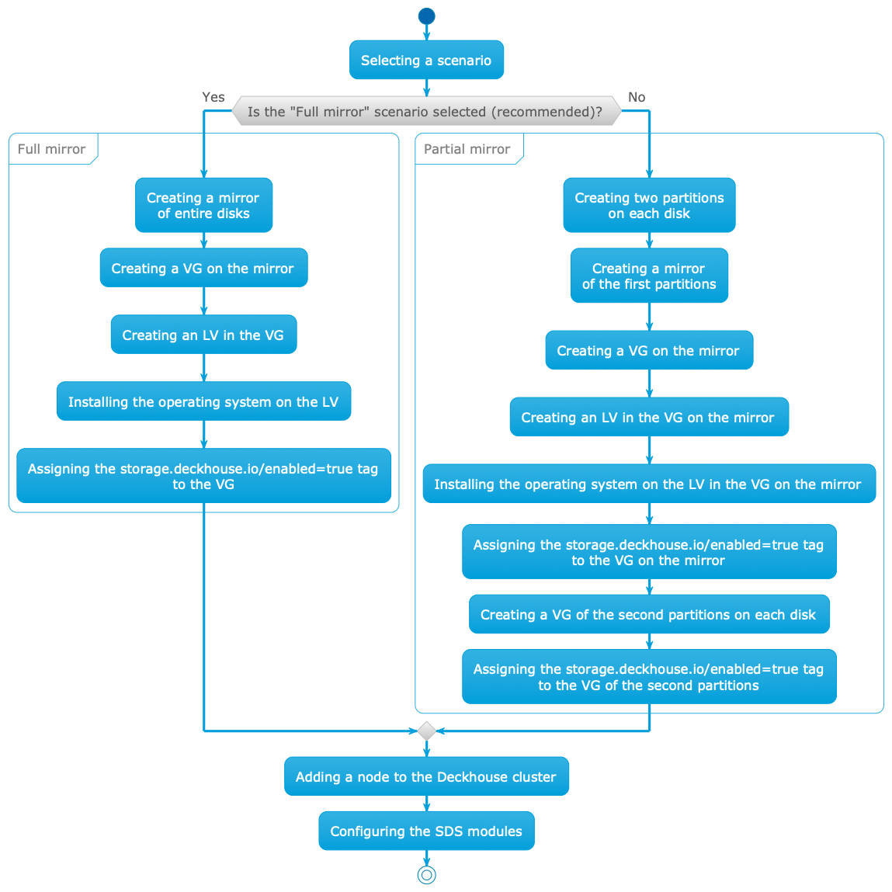


Module functionality is guaranteed only when using stock kernels provided with [supported distributions](/products/kubernetes-platform/documentation/v1/reference/supported_versions.html#linux).

Module functionality when using other kernels or distributions is possible but not guaranteed.



If you create virtual machines by cloning, change the UUID of Volume Groups on VMs created this way. Cloned Volume Groups have identical UUIDs, which can lead to conflicts. For detailed instructions, see the section ["How do I change the UUID of Volume Groups when cloning virtual machines?"](./faq.html#how-do-i-change-the-uuid-of-volume-groups-when-cloning-virtual-machines).


## Methods and scenarios for configuring node disk subsystem

There are two methods for configuring the disk subsystem on Kubernetes cluster nodes depending on storage organization conditions:

- [Storage with identical disks](#storage-with-identical-disks)
- [Combined storage](#combined-storage)

For each disk subsystem configuration method on nodes, there are two configuration scenarios:

- ["Full mirror"](#full-mirror): Recommended to use as it is reliable and simple to configure.
- ["Partial mirror"](#partial-mirror).

Features, pros and cons of scenarios are shown in the table:

| Configuration scenario | Implementation features                                                                                                                                                                                                                                | Pros                                                                                                                    | Cons                                                                                                                          |
|-----------------------|-------------------------------------------------------------------------------------------------------------------------------------------------------------------------------------------------------------------------------------------------------|--------------------------------------------------------------------------------------------------------------------------|---------------------------------------------------------------------------------------------------------------------------------|
| "Full mirror"      | <ul><li>Disks are not divided into partitions, mirror is made from entire disks</li><li>One Volume Group is used for root system and for data</li></ul>                                                                                            | <ul><li>Reliable</li><li>Simple to configure and use</li><li>Convenient to distribute space between different SDS</li></ul> | <ul><li>Excessive disk space for software-defined storage (SDS) that replicate data themselves</li></ul>         |
| "Partial mirror"   | <ul><li>Disks are divided into 2 partitions</li><li>Mirror is created from first partitions of each disk. A Volume Group is created on it where the OS is installed</li><li>Volume group for data is created from second disk partitions without mirroring</li></ul> | <ul><li>Reliable</li><li>Maximum efficient use of space</li></ul>                                                      | <ul><li>Complex to configure and use</li><li>Very difficult to redistribute space between safe and unsafe partitions</li></ul> |

Differences in disk subsystem configuration depending on the selected scenario are shown in the diagram:



## Storage with identical disks

Use this method when the node has disks of the same type.

### Full mirror

This scenario is recommended to use as it is reliable and simple to configure.

Configure the node according to this scenario:

1. Assemble a mirror from entire disks (hardware or software). This mirror will be used simultaneously for the root system and for data.

1. When installing the operating system:

   - Create a Volume Group named `main` on the mirror.
   - Create a Logical Volume named `root` in the `main` Volume Group.
   - Install the operating system on the `root` Logical Volume.

1. Set the `storage.deckhouse.io/enabled=true` tag for the `main` Volume Group by running the command:

   ```shell
   vgchange main --addtag storage.deckhouse.io/enabled=true
   ```

1. Add the prepared node to the cluster.

   If the node matches the `nodeSelector` specified in `spec.nodeSelector` of `sds-replicated-volume` or `sds-local-volume` modules, the `sds-node-configurator` module agent will start on the node. The agent will discover the `main` Volume Group and create the corresponding [LVMVolumeGroup](./cr.html#lvmvolumegroup) resource in the cluster. The resource can be used to create volumes in `sds-replicated-volume` or `sds-local-volume` modules.

#### SDS modules configuration example (identical disks, "Full mirror")

Configure three nodes according to the ["Full mirror"](#full-mirror) scenario. After configuration, three [LVMVolumeGroup](./cr.html#lvmvolumegroup) resources with randomly generated names will be created in the cluster.
In the future, it will be possible to specify names for [LVMVolumeGroup](./cr.html#lvmvolumegroup) resources created during automatic Volume Group discovery by adding an `LVM` tag with the desired resource name.

List [LVMVolumeGroup](./cr.html#lvmvolumegroup) resources by running the command:

```shell
d8 k get lvmvolumegroups.storage.deckhouse.io
```

Example output:

```console
NAME                                      THINPOOLS   CONFIGURATION APPLIED   PHASE   NODE       SIZE      ALLOCATED SIZE   VG     AGE
vg-08d3730c-9201-428d-966c-45795cba55a6   0/0         True                    Ready   worker-2   25596Mi   0                main   61s
vg-b59ff9e1-6ef2-4761-b5d2-6172926d4f4d   0/0         True                    Ready   worker-0   25596Mi   0                main   4m17s
vg-c7863e12-c143-42bb-8e33-d578ce50d6c7   0/0         True                    Ready   worker-1   25596Mi   0                main   108s
```

##### `sds-local-volume` module configuration (identical disks, "Full mirror")

Configure the `sds-local-volume` module according to the ["Full mirror"](#full-mirror) scenario: create a [LocalStorageClass](/modules/sds-local-volume/cr.html#localstorageclass) resource and add all [LVMVolumeGroup](./cr.html#lvmvolumegroup) resources to it, so that the `main` Volume Group is used on all nodes in the `sds-local-volume` module. Run the command:

```shell
d8 k apply -f -<<EOF
apiVersion: storage.deckhouse.io/v1alpha1
kind: LocalStorageClass
metadata:
  name: local-sc
spec:
  lvm:
    lvmVolumeGroups:
      - name: vg-08d3730c-9201-428d-966c-45795cba55a6
      - name: vg-b59ff9e1-6ef2-4761-b5d2-6172926d4f4d
      - name: vg-c7863e12-c143-42bb-8e33-d578ce50d6c7
    type: Thick
  reclaimPolicy: Delete
  volumeBindingMode: WaitForFirstConsumer
EOF
```

##### `sds-replicated-volume` module configuration (identical disks, "Full mirror")

Configure the `sds-replicated-volume` module according to the ["Full mirror"](#full-mirror) scenario:

1. Create a [ReplicatedStoragePool](/modules/sds-replicated-volume/cr.html#replicatedstoragepool) resource and add all [LVMVolumeGroup](./cr.html#lvmvolumegroup) resources to it, so that the `main` Volume Group is used on all nodes in the `sds-replicated-volume` module. Run the command:

   ```shell
   d8 k apply -f -<<EOF
   apiVersion: storage.deckhouse.io/v1alpha1
   kind: ReplicatedStoragePool
   metadata:
     name: data
   spec:
     type: LVM
     lvmVolumeGroups:
       - name: vg-08d3730c-9201-428d-966c-45795cba55a6
       - name: vg-b59ff9e1-6ef2-4761-b5d2-6172926d4f4d
       - name: vg-c7863e12-c143-42bb-8e33-d578ce50d6c7
   EOF
   ```

1. Create a [ReplicatedStorageClass](/modules/sds-replicated-volume/cr.html#replicatedstorageclass) resource and specify the name of the previously created [ReplicatedStoragePool](/modules/sds-replicated-volume/cr.html#replicatedstoragepool) resource in the `storagePool` field. Run the command:

   ```shell
   d8 k apply -f -<<EOF
   ---
   apiVersion: storage.deckhouse.io/v1alpha1
   kind: ReplicatedStorageClass
   metadata:
     name: replicated-sc-r1
   spec:
     storagePool: data
     replication: None
     reclaimPolicy: Delete
     topology: Ignored # When specifying this topology, there should be no zones in the cluster (nodes with topology.kubernetes.io/zone labels)
   ---
   apiVersion: storage.deckhouse.io/v1alpha1
   kind: ReplicatedStorageClass
   metadata:
     name: replicated-sc-r2
   spec:
     storagePool: data
     replication: Availability
     reclaimPolicy: Delete
     topology: Ignored # When specifying this topology, there should be no zones
   ---
   apiVersion: storage.deckhouse.io/v1alpha1
   kind: ReplicatedStorageClass
   metadata:
     name: replicated-sc-r3
   spec:
     storagePool: data
     replication: ConsistencyAndAvailability
     reclaimPolicy: Delete
     topology: Ignored # When specifying this topology, there should be no zones
   EOF
   ```

### Partial mirror


Using partitions with identical PARTUUID is not supported, as well as changing PARTUUID of a partition that is used to create a Volume Group.
When creating a partition table, it is recommended to choose the `GPT` format, as PARTUUID in `MBR` is pseudo-random and contains the partition number.
In addition, the PARTLABEL attribute cannot be set in `MBR`, which may be useful for subsequent partition identification.


In this scenario, two partitions are created on each disk:

- The first partition is used to create a mirror where the root system and SDS data that are not replicated are placed.
- The second partition is used to create a separate Volume Group without mirroring for SDS data that are replicated.

This allows for maximum efficient use of disk space.

Configure the node according to the ["Partial mirror"](#partial-mirror) scenario:

1. When installing the operating system:

    - Create two partitions on each disk.
    - Assemble a mirror from the first partitions on each disk.
    - Create a Volume Group named `main-safe` on the mirror.
    - Create a Logical Volume named `root` in the `main-safe` Volume Group.
    - Install the operating system on the `root` Logical Volume.

1. Set the `storage.deckhouse.io/enabled=true` tag for the `main-safe` Volume Group by running the command:

   ```shell
   vgchange main-safe --addtag storage.deckhouse.io/enabled=true
   ```

1. Create a Volume Group named `main-unsafe` from the second partitions of each disk.

1. Set the `storage.deckhouse.io/enabled=true` tag for the `main-unsafe` Volume Group by running the command:

   ```shell
   vgchange main-unsafe --addtag storage.deckhouse.io/enabled=true
   ```

1. Add the prepared node to the cluster.

   If the node matches the `nodeSelector` specified in `spec.nodeSelector` of `sds-replicated-volume` or `sds-local-volume` modules, the `sds-node-configurator` module agent will start on the node. The agent will discover the `main-safe` and `main-unsafe` Volume Groups and create the corresponding [LVMVolumeGroup](./cr.html#lvmvolumegroup) resources in the cluster. The resources can be used to create volumes in `sds-replicated-volume` or `sds-local-volume` modules.

#### SDS modules configuration example (identical disks, "Partial mirror")

This example describes configuring three nodes according to the ["Partial mirror"](#partial-mirror) scenario. After configuration, six [LVMVolumeGroup](./cr.html#lvmvolumegroup) resources with randomly generated names will be created in the cluster.
In the future, it will be possible to specify names for [LVMVolumeGroup](./cr.html#lvmvolumegroup) resources created during automatic Volume Group discovery by adding an `LVM` tag with the desired resource name.

List [LVMVolumeGroup](./cr.html#lvmvolumegroup) resources by running the command:

```shell
d8 k get lvmvolumegroups.storage.deckhouse.io
```

Example output:

```console
NAME                                      THINPOOLS   CONFIGURATION APPLIED   PHASE   NODE       SIZE      ALLOCATED SIZE   VG            AGE
vg-08d3730c-9201-428d-966c-45795cba55a6   0/0         True                    Ready   worker-2   25596Mi   0                main-safe     61s
vg-b59ff9e1-6ef2-4761-b5d2-6172926d4f4d   0/0         True                    Ready   worker-0   25596Mi   0                main-safe     4m17s
vg-c7863e12-c143-42bb-8e33-d578ce50d6c7   0/0         True                    Ready   worker-1   25596Mi   0                main-safe     108s
vg-deccf08a-44d4-45f2-aea9-6232c0eeef91   0/0         True                    Ready   worker-2   25596Mi   0                main-unsafe   61s
vg-e0f00cab-03b3-49cf-a2f6-595628a2593c   0/0         True                    Ready   worker-0   25596Mi   0                main-unsafe   4m17s
vg-fe679d22-2bc7-409c-85a9-9f0ee29a6ca2   0/0         True                    Ready   worker-1   25596Mi   0                main-unsafe   108s
```

##### `sds-local-volume` module configuration (identical disks, "Partial mirror")

Configure the `sds-local-volume` module according to the ["Partial mirror"](#partial-mirror) scenario: create a [LocalStorageClass](/modules/sds-local-volume/cr.html#localstorageclass) resource and add [LVMVolumeGroup](./cr.html#lvmvolumegroup) resources to it, so that only the `main-safe` Volume Group is used on all nodes in the `sds-local-volume` module. Run the command:

```shell
d8 k apply -f -<<EOF
apiVersion: storage.deckhouse.io/v1alpha1
kind: LocalStorageClass
metadata:
  name: local-sc
spec:
  lvm:
    lvmVolumeGroups:
      - name: vg-08d3730c-9201-428d-966c-45795cba55a6
      - name: vg-b59ff9e1-6ef2-4761-b5d2-6172926d4f4d
      - name: vg-c7863e12-c143-42bb-8e33-d578ce50d6c7
    type: Thick
  reclaimPolicy: Delete
  volumeBindingMode: WaitForFirstConsumer
EOF
```

##### `sds-replicated-volume` module configuration (identical disks, "Partial mirror")

Configure the `sds-replicated-volume` module according to the ["Partial mirror"](#partial-mirror) scenario:

1. Create a [ReplicatedStoragePool](/modules/sds-replicated-volume/cr.html#replicatedstoragepool) resource named `data-safe` and add [LVMVolumeGroup](./cr.html#lvmvolumegroup) resources to it, so that only the `main-safe` Volume Group is used on all nodes in the `sds-replicated-volume` module in [ReplicatedStorageClass](/modules/sds-replicated-volume/cr.html#replicatedstorageclass) with `replication: None` parameter. Run the command:

   ```shell
   d8 k apply -f -<<EOF
   apiVersion: storage.deckhouse.io/v1alpha1
   kind: ReplicatedStoragePool
   metadata:
     name: data-safe
   spec:
     type: LVM
     lvmVolumeGroups:
       - name: vg-08d3730c-9201-428d-966c-45795cba55a6
       - name: vg-b59ff9e1-6ef2-4761-b5d2-6172926d4f4d
       - name: vg-c7863e12-c143-42bb-8e33-d578ce50d6c7
   EOF
   ```

1. Create a [ReplicatedStoragePool](/modules/sds-replicated-volume/cr.html#replicatedstoragepool) resource named `data-unsafe` and add [LVMVolumeGroup](./cr.html#lvmvolumegroup) resources to it, so that only the `main-unsafe` Volume Group is used on all nodes in the `sds-replicated-volume` module in [ReplicatedStorageClass](/modules/sds-replicated-volume/cr.html#replicatedstorageclass) with `replication: Availability` or `replication: ConsistencyAndAvailability` parameter. Run the command:

   ```shell
   d8 k apply -f -<<EOF
   apiVersion: storage.deckhouse.io/v1alpha1
   kind: ReplicatedStoragePool
   metadata:
     name: data-unsafe
   spec:
     type: LVM
     lvmVolumeGroups:
       - name: vg-deccf08a-44d4-45f2-aea9-6232c0eeef91
       - name: vg-e0f00cab-03b3-49cf-a2f6-595628a2593c
       - name: vg-fe679d22-2bc7-409c-85a9-9f0ee29a6ca2
   EOF
   ```

1. Create a [ReplicatedStorageClass](/modules/sds-replicated-volume/cr.html#replicatedstorageclass) resource and specify the names of previously created [ReplicatedStoragePool](/modules/sds-replicated-volume/cr.html#replicatedstoragepool) resources in the `storagePool` field, so that both `main-safe` and `main-unsafe` Volume Groups are used on all nodes. Run the command:

   ```shell
   d8 k apply -f -<<EOF
   ---
   apiVersion: storage.deckhouse.io/v1alpha1
   kind: ReplicatedStorageClass
   metadata:
     name: replicated-sc-r1
   spec:
     storagePool: data-safe # Note that `data-safe` should be used for this resource, since it has `replication: None` specified, which means that data replication for persistent volumes (PV) created with this StorageClass will not be performed
     replication: None
     reclaimPolicy: Delete
     topology: Ignored # When specifying this topology, there should be no zones in the cluster (nodes with topology.kubernetes.io/zone labels)
   ---
   apiVersion: storage.deckhouse.io/v1alpha1
   kind: ReplicatedStorageClass
   metadata:
     name: replicated-sc-r2
   spec:
     storagePool: data-unsafe # Note that `data-unsafe` should be used for this resource, since it has `replication: Availability` specified, which means that data replication for persistent volumes (PV) created with this StorageClass will be performed
     replication: Availability
     reclaimPolicy: Delete
     topology: Ignored # When specifying this topology, there should be no zones
   ---
   apiVersion: storage.deckhouse.io/v1alpha1
   kind: ReplicatedStorageClass
   metadata:
     name: replicated-sc-r3
   spec:
     storagePool: data-unsafe # Note that `data-unsafe` should be used for this resource, since it has `replication: ConsistencyAndAvailability` specified, which means that data replication for persistent volumes (PV) created with this StorageClass will be performed
     replication: ConsistencyAndAvailability
     reclaimPolicy: Delete
     topology: Ignored # When specifying this topology, there should be no zones
   EOF
   ```

## Combined storage

Use combined storage when using disks of different types simultaneously on the node.

When combining disks of different types to create storage, it is recommended to make a mirror from disks of one type and install the operating system on it according to the ["Full mirror"](#full-mirror) scenario, but not use it for SDS.

For SDS, use disks of other types (hereinafter — additional disks) that differ from those used for the mirror under the operating system.

Recommendations for using additional disks depending on their type:

| Disk type | Recommended usage purposes                        |
|-----------|---------------------------------------------------------|
| NVMe SSD  | Creating volumes requiring high performance    |
| SATA SSD  | Creating volumes not requiring high performance |
| HDD       | Creating volumes not requiring high performance |

Additional disks can be configured according to any of the ["Full mirror"](#full-mirror) or ["Partial mirror"](#partial-mirror) scenarios.

Below is the process of configuring additional disks using the following types as an example:

- NVMe SSD.
- SATA SSD.
- HDD.

### Additional disks configuration (Full mirror)


Below is the order of actions for configuring additional disks for the case of primary cluster deployment and configuration when connecting to nodes via SSH.
If you already have a working cluster and you are adding additional disks to its nodes, it is recommended to create and configure Volume Groups using the [LVMVolumeGroup](./resources.html#creation-by-a-user) resource, instead of executing the commands below on the node.


Configure additional disks on the node according to the ["Full mirror"](#full-mirror) scenario:

1. Assemble a mirror from all additional disks of a certain type entirely (hardware or software).
1. Create a Volume Group named `<vg-name>` on the mirror.
1. Set the `storage.deckhouse.io/enabled=true` tag for the `<vg-name>` Volume Group by running the command:

   ```shell
   vgchange <vg-name> --addtag storage.deckhouse.io/enabled=true
   ```


Replace `<vg-name>` with an informative name depending on the type of additional disks.

Examples of Volume Group names for additional disks of different types:

- `ssd-nvme`: For NVMe SSD disks.
- `ssd-sata`: For SATA SSD disks.
- `hdd`: For HDD disks.


#### SDS modules configuration example (combined storage, "Full mirror")

This example describes configuring three nodes according to the ["Full mirror"](#full-mirror) scenario. After configuration, three [LVMVolumeGroup](./cr.html#lvmvolumegroup) resources with randomly generated names will be created in the cluster.
In the future, it will be possible to specify names for [LVMVolumeGroup](./cr.html#lvmvolumegroup) resources created during automatic Volume Group discovery by adding an `LVM` tag with the desired resource name.

List [LVMVolumeGroup](./cr.html#lvmvolumegroup) resources by running the command:

```shell
d8 k get lvmvolumegroups.storage.deckhouse.io
```

Example output:

```console
NAME                                      THINPOOLS   CONFIGURATION APPLIED   PHASE   NODE       SIZE      ALLOCATED SIZE   VG          AGE
vg-08d3730c-9201-428d-966c-45795cba55a6   0/0         True                    Ready   worker-2   25596Mi   0                <vg-name>   61s
vg-b59ff9e1-6ef2-4761-b5d2-6172926d4f4d   0/0         True                    Ready   worker-0   25596Mi   0                <vg-name>   4m17s
vg-c7863e12-c143-42bb-8e33-d578ce50d6c7   0/0         True                    Ready   worker-1   25596Mi   0                <vg-name>   108s
```

`<vg-name>`: The name assigned to the Volume Group on the mirror in the previous step.

##### `sds-local-volume` module configuration (combined storage, "Full mirror")

Configure the `sds-local-volume` module according to the ["Full mirror"](#full-mirror) scenario: create a [LocalStorageClass](/modules/sds-local-volume/cr.html#localstorageclass) resource and add all [LVMVolumeGroup](./cr.html#lvmvolumegroup) resources to it, so that the `<vg-name>` Volume Group is used on all nodes in the `sds-local-volume` module. Run the command:

```shell
d8 k apply -f -<<EOF
apiVersion: storage.deckhouse.io/v1alpha1
kind: LocalStorageClass
metadata:
  name: <local-storage-class-name>
spec:
  lvm:
    lvmVolumeGroups:
      - name: vg-08d3730c-9201-428d-966c-45795cba55a6
      - name: vg-b59ff9e1-6ef2-4761-b5d2-6172926d4f4d
      - name: vg-c7863e12-c143-42bb-8e33-d578ce50d6c7
    type: Thick
  reclaimPolicy: Delete
  volumeBindingMode: WaitForFirstConsumer
EOF
```


In the example above, replace `<local-storage-class-name>` with an informative name, depending on the type of additional disks.

Examples of informative names for [LocalStorageClass](/modules/sds-local-volume/cr.html#localstorageclass) resource for additional disks of different types:

- `local-sc-ssd-nvme`: For NVMe SSD disks.
- `local-sc-ssd-sata`: For SATA SSD disks.
- `local-sc-ssd-hdd`: For HDD disks.


##### `sds-replicated-volume` module configuration (combined storage, "Full mirror")

Configure the `sds-replicated-volume` module according to the ["Full mirror"](#full-mirror) scenario:

1. Create a [ReplicatedStoragePool](/modules/sds-replicated-volume/cr.html#replicatedstoragepool) resource and add all [LVMVolumeGroup](./cr.html#lvmvolumegroup) resources to it, so that the `<vg-name>` Volume Group is used on all nodes in the `sds-replicated-volume` module. Run the command:

   ```shell
   d8 k apply -f -<<EOF
   apiVersion: storage.deckhouse.io/v1alpha1
   kind: ReplicatedStoragePool
   metadata:
     name: <replicated-storage-pool-name>
   spec:
     type: LVM
     lvmVolumeGroups:
       - name: vg-08d3730c-9201-428d-966c-45795cba55a6
       - name: vg-b59ff9e1-6ef2-4761-b5d2-6172926d4f4d
       - name: vg-c7863e12-c143-42bb-8e33-d578ce50d6c7
   EOF
   ```

   > Replace `<replicated-storage-pool-name>` with an informative name depending on the type of additional disks.
   >
   > Examples of informative names for [ReplicatedStoragePool](/modules/sds-replicated-volume/cr.html#replicatedstoragepool) resource for additional disks of different types:
   >
   > - `data-ssd-nvme`: For NVMe SSD disks.
   > - `data-ssd-sata`: For SATA SSD disks.
   > - `data-hdd`: For HDD disks.

1. Create a [ReplicatedStorageClass](/modules/sds-replicated-volume/cr.html#replicatedstorageclass) resource and specify the name of the previously created [ReplicatedStoragePool](/modules/sds-replicated-volume/cr.html#replicatedstoragepool) resource in the `storagePool` field. Run the command:

   ```shell
   d8 k apply -f -<<EOF
   ---
   apiVersion: storage.deckhouse.io/v1alpha1
   kind: ReplicatedStorageClass
   metadata:
     name: replicated-sc-ssd-nvme-r1
   spec:
     storagePool: <replicated-storage-pool-name>
     replication: None
     reclaimPolicy: Delete
     topology: Ignored # When specifying this topology, there should be no zones in the cluster (nodes with topology.kubernetes.io/zone labels)
   ---
   apiVersion: storage.deckhouse.io/v1alpha1
   kind: ReplicatedStorageClass
   metadata:
     name: replicated-sc-ssd-nvme-r2
   spec:
     storagePool: <replicated-storage-pool-name>
     replication: Availability
     reclaimPolicy: Delete
     topology: Ignored # When specifying this topology, there should be no zones
   ---
   apiVersion: storage.deckhouse.io/v1alpha1
   kind: ReplicatedStorageClass
   metadata:
     name: replicated-sc-ssd-nvme-r3
   spec:
     storagePool: <replicated-storage-pool-name>
     replication: ConsistencyAndAvailability
     reclaimPolicy: Delete
     topology: Ignored # When specifying this topology, there should be no zones
   EOF
   ```

### Additional disks configuration (Partial mirror)


Using partitions with identical PARTUUID is not supported, as well as changing PARTUUID of a partition that is used to create a Volume Group.
When creating a partition table, it is recommended to choose the `GPT` format, as PARTUUID in `MBR` is pseudo-random and contains the partition number.
In addition, the PARTLABEL attribute cannot be set in `MBR`, which may be useful for subsequent partition identification.



Below is the order of actions for configuring additional disks for the case of primary cluster deployment and configuration when connecting to nodes via SSH.
If you already have a working cluster and you are adding additional disks to its nodes, it is recommended to create and configure Volume Groups using the [LVMVolumeGroup](./resources.html#creation-by-a-user) resource, instead of executing the commands below on the node.


In this scenario, two partitions are created on each disk:

- The first partition is used to create a mirror for SDS data that are not replicated.
- The second partition is used to create a separate Volume Group without mirroring for SDS data that are replicated.

This allows for maximum efficient use of disk space.

Configure the node with additional disks according to the ["Partial mirror"](#partial-mirror) scenario:

1. Create two partitions on each additional disk.

1. Assemble a mirror from the first partitions on each disk.

1. Create a Volume Group named `<vg-name>-safe` on the mirror.

1. Create a Volume Group named `<vg-name>-unsafe` from the second partitions of each disk.

1. Set the `storage.deckhouse.io/enabled=true` tag for the `<vg-name>-safe` and `<vg-name>-unsafe` Volume Groups by running the commands:

   ```shell
   vgchange <vg-name>-safe --addtag storage.deckhouse.io/enabled=true
   vgchange <vg-name>-unsafe --addtag storage.deckhouse.io/enabled=true
   ```

   > Replace `<vg-name>` with an informative prefix depending on the type of additional disks.
   >
   > Examples of informative prefix `<vg-name>` for additional disks of different types:
   >
   > - `ssd-nvme`: For NVMe SSD disks.
   > - `ssd-sata`: For SATA SSD disks.
   > - `hdd`: For HDD disks.

#### SDS modules configuration example (combined storage, "Partial mirror")

This example describes configuring three nodes according to the ["Partial mirror"](#partial-mirror) scenario. After configuration, six [LVMVolumeGroup](./cr.html#lvmvolumegroup) resources with randomly generated names will be created in the cluster.
In the future, it will be possible to specify names for [LVMVolumeGroup](./cr.html#lvmvolumegroup) resources created during automatic Volume Group discovery by adding an `LVM` tag with the desired resource name.

List [LVMVolumeGroup](./cr.html#lvmvolumegroup) resources by running the command:

```shell
d8 k get lvmvolumegroups.storage.deckhouse.io
```

Example output:

```console
NAME                                      THINPOOLS   CONFIGURATION APPLIED   PHASE   NODE       SIZE      ALLOCATED SIZE   VG                AGE
vg-08d3730c-9201-428d-966c-45795cba55a6   0/0         True                    Ready   worker-2   25596Mi   0                <vg-name>-safe     61s
vg-b59ff9e1-6ef2-4761-b5d2-6172926d4f4d   0/0         True                    Ready   worker-0   25596Mi   0                <vg-name>-safe     4m17s
vg-c7863e12-c143-42bb-8e33-d578ce50d6c7   0/0         True                    Ready   worker-1   25596Mi   0                <vg-name>-safe     108s
vg-deccf08a-44d4-45f2-aea9-6232c0eeef91   0/0         True                    Ready   worker-2   25596Mi   0                <vg-name>-unsafe   61s
vg-e0f00cab-03b3-49cf-a2f6-595628a2593c   0/0         True                    Ready   worker-0   25596Mi   0                <vg-name>-unsafe   4m17s
vg-fe679d22-2bc7-409c-85a9-9f0ee29a6ca2   0/0         True                    Ready   worker-1   25596Mi   0                <vg-name>-unsafe   108s
```

`<vg-name>`: The prefix of the name assigned to the Volume Group created in the previous step.

##### `sds-local-volume` module configuration (combined storage, "Partial mirror")

Configure the `sds-local-volume` module according to the ["Partial mirror"](#partial-mirror) scenario: create a [LocalStorageClass](/modules/sds-local-volume/cr.html#localstorageclass) resource and add [LVMVolumeGroup](./cr.html#lvmvolumegroup) resources to it, so that only the `<vg-name>-safe` Volume Group is used on all nodes in the `sds-local-volume` module. Run the command:

```shell
d8 k apply -f -<<EOF
apiVersion: storage.deckhouse.io/v1alpha1
kind: LocalStorageClass
metadata:
  name: <local-storage-class-name>
spec:
  lvm:
    lvmVolumeGroups:
      - name: vg-08d3730c-9201-428d-966c-45795cba55a6
      - name: vg-b59ff9e1-6ef2-4761-b5d2-6172926d4f4d
      - name: vg-c7863e12-c143-42bb-8e33-d578ce50d6c7
    type: Thick
  reclaimPolicy: Delete
  volumeBindingMode: WaitForFirstConsumer
EOF
```


In the example above, replace `<local-storage-class-name>` with an informative name, depending on the type of additional disks.

Examples of informative names for [LocalStorageClass](/modules/sds-local-volume/cr.html#localstorageclass) resource for additional disks of different types:

- `local-sc-ssd-nvme`: For NVMe SSD disks.
- `local-sc-ssd-sata`: For SATA SSD disks.
- `local-sc-hdd`: For HDD disks.


##### `sds-replicated-volume` module configuration (combined storage, "Partial mirror")

Configure the `sds-replicated-volume` module according to the ["Partial mirror"](#partial-mirror) scenario:

1. Create a [ReplicatedStoragePool](/modules/sds-replicated-volume/cr.html#replicatedstoragepool) resource named `data-<vg-name>-safe` and add [LVMVolumeGroup](./cr.html#lvmvolumegroup) resources to it, so that only the `<vg-name>-safe` Volume Group is used on all nodes in the `sds-replicated-volume` module in [ReplicatedStorageClass](/modules/sds-replicated-volume/cr.html#replicatedstorageclass) with `replication: None` parameter. Run the command:

   ```shell
   d8 k apply -f -<<EOF
   apiVersion: storage.deckhouse.io/v1alpha1
   kind: ReplicatedStoragePool
   metadata:
     name: data-<vg-name>-safe
   spec:
     type: LVM
     lvmVolumeGroups:
       - name: vg-08d3730c-9201-428d-966c-45795cba55a6
       - name: vg-b59ff9e1-6ef2-4761-b5d2-6172926d4f4d
       - name: vg-c7863e12-c143-42bb-8e33-d578ce50d6c7
   EOF
   ```

   > Replace `data-<vg-name>-safe` with an informative name depending on the type of additional disks.
   >
   > Examples of informative names for [ReplicatedStoragePool](/modules/sds-replicated-volume/cr.html#replicatedstoragepool) resource for additional disks of different types:
   >
   > - `data-ssd-nvme-safe`: For NVMe SSD disks.
   > - `data-ssd-sata-safe`: For SATA SSD disks.
   > - `data-hdd-safe`: For HDD disks.

1. Create a [ReplicatedStoragePool](/modules/sds-replicated-volume/cr.html#replicatedstoragepool) resource named `data-<vg-name>-unsafe` and add [LVMVolumeGroup](./cr.html#lvmvolumegroup) resources to it, so that only the `<vg-name>-unsafe` Volume Group is used on all nodes in the `sds-replicated-volume` module in [ReplicatedStorageClass](/modules/sds-replicated-volume/cr.html#replicatedstorageclass) with `replication: Availability` or `replication: ConsistencyAndAvailability` parameter. Run the command:

   ```shell
   d8 k apply -f -<<EOF
   apiVersion: storage.deckhouse.io/v1alpha1
   kind: ReplicatedStoragePool
   metadata:
     name: data-<vg-name>-unsafe
   spec:
     type: LVM
     lvmVolumeGroups:
       - name: vg-deccf08a-44d4-45f2-aea9-6232c0eeef91
       - name: vg-e0f00cab-03b3-49cf-a2f6-595628a2593c
       - name: vg-fe679d22-2bc7-409c-85a9-9f0ee29a6ca2
   EOF
   ```

   > In the example above, replace `data-<vg-name>-unsafe` with an informative name, depending on the type of additional disks.
   >
   > Examples of informative names for [ReplicatedStoragePool](/modules/sds-replicated-volume/cr.html#replicatedstoragepool) resource for additional disks of different types:
   >
   > - `data-ssd-nvme-unsafe`: For NVMe SSD disks.
   > - `data-ssd-sata-unsafe`: For SATA SSD disks.
   > - `data-hdd-unsafe`: For HDD disks.

1. Create a [ReplicatedStorageClass](/modules/sds-replicated-volume/cr.html#replicatedstorageclass) resource and specify the names of previously created [ReplicatedStoragePool](/modules/sds-replicated-volume/cr.html#replicatedstoragepool) resources in the `storagePool` field, so that both `<vg-name>-safe` and `<vg-name>-unsafe` Volume Groups are used on all nodes. Run the command:

   ```shell
   d8 k apply -f -<<EOF
   ---
   apiVersion: storage.deckhouse.io/v1alpha1
   kind: ReplicatedStorageClass
   metadata:
     name: replicated-sc-ssd-nvme-r1
   spec:
     storagePool: data-<vg-name>-safe # Note that `data-<vg-name>-safe` should be used for this resource, since it has `replication: None` specified, which means that data replication for persistent volumes (PV) created with this StorageClass will not be performed
     replication: None
     reclaimPolicy: Delete
     topology: Ignored # When specifying this topology, there should be no zones in the cluster (nodes with topology.kubernetes.io/zone labels)
   ---
   apiVersion: storage.deckhouse.io/v1alpha1
   kind: ReplicatedStorageClass
   metadata:
     name: replicated-sc-ssd-nvme-r2
   spec:
     storagePool: data-<vg-name>-unsafe # Note that `data-<vg-name>-unsafe` should be used for this resource, since it has `replication: Availability` specified, which means that data replication for persistent volumes (PV) created with this StorageClass will be performed
     replication: Availability
     reclaimPolicy: Delete
     topology: Ignored # When specifying this topology, there should be no zones
   ---
   apiVersion: storage.deckhouse.io/v1alpha1
   kind: ReplicatedStorageClass
   metadata:
     name: replicated-sc-ssd-nvme-r3
   spec:
     storagePool: data-<vg-name>-unsafe # Note that `data-<vg-name>-unsafe` should be used for this resource, since it has `replication: ConsistencyAndAvailability` specified, which means that data replication for persistent volumes (PV) created with this StorageClass will be performed
     replication: ConsistencyAndAvailability
     reclaimPolicy: Delete
     topology: Ignored # When specifying this topology, there should be no zones
   EOF
   ```

   > Replace `data-<vg-name>-unsafe` with an informative name depending on the type of additional disks.
   >
   > Examples of informative names for [ReplicatedStoragePool](/modules/sds-replicated-volume/cr.html#replicatedstoragepool) resource for additional disks of different types:
   >
   > - `data-ssd-nvme-unsafe`: For NVMe SSD disks.
   > - `data-ssd-sata-unsafe`: For SATA SSD disks.
   > - `data-hdd-unsafe`: For HDD disks.
   >
   > Replace `data-<vg-name>-safe` with an informative name depending on the type of additional disks.
   >
   > Examples of informative names for [ReplicatedStoragePool](/modules/sds-replicated-volume/cr.html#replicatedstoragepool) resource for additional disks of different types:
   >
   > - `data-ssd-nvme-safe`: For NVMe SSD disks.
   > - `data-ssd-sata-safe`: For SATA SSD disks.
   > - `data-hdd-safe`: For HDD disks.
