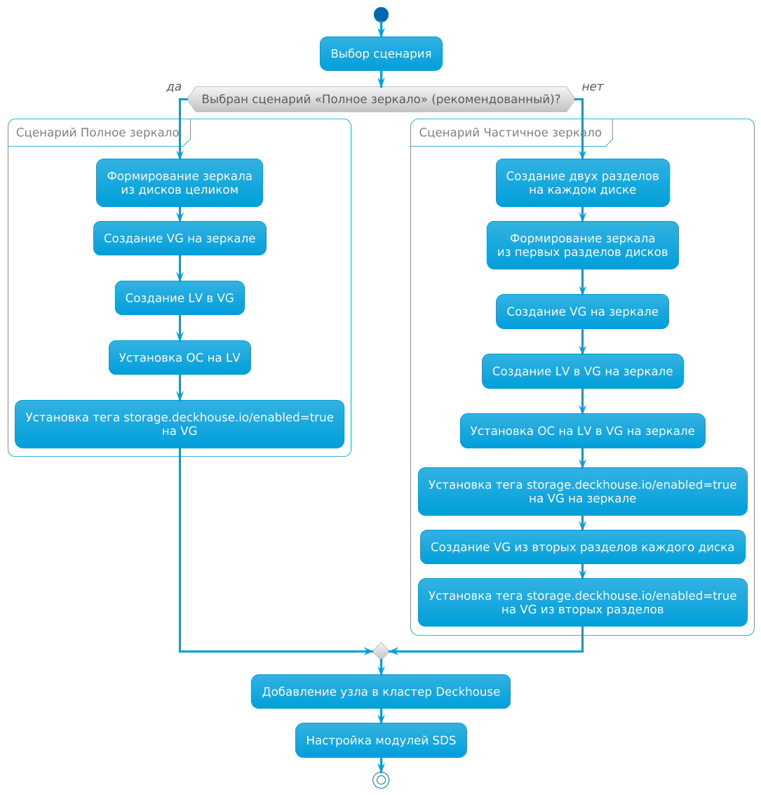


Работоспособность модуля гарантируется только при использовании стоковых ядер, поставляемых вместе с [поддерживаемыми дистрибутивами](/products/kubernetes-platform/documentation/v1/reference/supported_versions.html#linux).

Работоспособность модуля при использовании других ядер или дистрибутивов возможна, но не гарантируется.



Если вы создаёте виртуальные машины клонированием, измените UUID у групп томов на созданных таким образом виртуальных машинах. Клонированные группы томов имеют идентичные UUID, что может привести к конфликтам. Подробные инструкции см. в разделе [«Изменение UUID у групп томов при клонировании виртуальных машин»](./faq.html#изменение-uuid-у-групп-томов-при-клонировании-виртуальных-машин).


## Способы и сценарии конфигурации дисковой подсистемы узлов

Существуют два способа конфигурации дисковой подсистемы на узлах кластера Kubernetes в зависимости от условий организации хранилища:

- [Хранилище с одинаковыми дисками](#хранилище-с-одинаковыми-дисками).
- [Комбинированное хранилище](#комбинированное-хранилище).

Для каждого из способов конфигурации дисковой подсистемы на узлах существует два сценария конфигурации:

- [«Полное зеркало»](#полное-зеркало) — рекомендуется использовать, так как надёжен и прост в настройке.
- [«Частичное зеркало»](#частичное-зеркало).

Особенности, плюсы и минусы сценариев приведены в таблице:

| Сценарий конфигурации | Особенности реализации                                                                                                                                                                                                                                | Плюсы                                                                                                                    | Минусы                                                                                                                          |
|-----------------------|-------------------------------------------------------------------------------------------------------------------------------------------------------------------------------------------------------------------------------------------------------|--------------------------------------------------------------------------------------------------------------------------|---------------------------------------------------------------------------------------------------------------------------------|
| «Полное зеркало»      | <ul><li>Диски не делятся на разделы, делается зеркало из дисков целиком</li><li>Используется одна группа томов для корневой системы и для данных</li></ul>                                                                                            | <ul><li>Надежно</li><li>Просто в настройке и использовании</li><li>Удобно распределять место между разными SDS</li></ul> | <ul><li>Избыточное место на диске для программно-определяемых хранилищ (SDS), которые сами реплицируют данные</li></ul>         |
| «Частичное зеркало»   | <ul><li>Диски делятся на 2 раздела</li><li>Из первых разделов каждого диска создается зеркало. На нем создается группа томов, куда устанавливается ОС</li><li>Из вторых разделов диска создается группа томов для данных, без зеркалирования</li></ul> | <ul><li>Надежно</li><li>Максимально эффективное использование места</li></ul>                                                      | <ul><li>Сложно в настройке и использовании</li><li>Очень сложно перераспределять место между safe- и unsafe-разделами</li></ul> |

Различия в конфигурации дисковой подсистемы в зависимости от выбранного сценария изображены на схеме:



## Хранилище с одинаковыми дисками

Используйте этот способ при наличии на узле дисков одного типа.

### Полное зеркало

Этот сценарий рекомендуется использовать, так как он надёжен и прост в настройке.

Настройте узел по этому сценарию:

1. Соберите зеркало из дисков целиком (аппаратно или программно). Это зеркало будет использоваться одновременно для корневой системы и для данных.

1. При установке операционной системы:

   - создайте группу томов с именем `main` на зеркале;
   - создайте логический том с именем `root` в группе томов `main`;
   - установите операционную систему на логический том `root`.

1. Установите тег `storage.deckhouse.io/enabled=true` для группы томов `main`, выполнив команду:

   ```shell
   vgchange main --addtag storage.deckhouse.io/enabled=true
   ```

1. Добавьте подготовленный узел в кластер.

   Если узел соответствует `nodeSelector`, указанному в `spec.nodeSelector` модулей `sds-replicated-volume` или `sds-local-volume`, на узле запустится агент модуля `sds-node-configurator`. Агент обнаружит группу томов `main` и создаст соответствующий ресурс [LVMVolumeGroup](./cr.html#lvmvolumegroup) в кластере. Ресурс можно использовать для создания томов в модулях `sds-replicated-volume` или `sds-local-volume`.

#### Пример настройки модулей SDS (одинаковые диски, «Полное зеркало»)

Настройте три узла по сценарию [«Полное зеркало»](#полное-зеркало). После настройки в кластере будут созданы три ресурса [LVMVolumeGroup](./cr.html#lvmvolumegroup) со случайно сгенерированными именами.
В будущем будет возможность указать имя для ресурсов [LVMVolumeGroup](./cr.html#lvmvolumegroup), создаваемых при автоматическом обнаружении групп томов, путём добавления тега `LVM` с желаемым именем ресурса.

Выведите список ресурсов [LVMVolumeGroup](./cr.html#lvmvolumegroup), выполнив команду:

```shell
d8 k get lvmvolumegroups.storage.deckhouse.io
```

Пример вывода:

```console
NAME                                      THINPOOLS   CONFIGURATION APPLIED   PHASE   NODE       SIZE      ALLOCATED SIZE   VG     AGE
vg-08d3730c-9201-428d-966c-45795cba55a6   0/0         True                    Ready   worker-2   25596Mi   0                main   61s
vg-b59ff9e1-6ef2-4761-b5d2-6172926d4f4d   0/0         True                    Ready   worker-0   25596Mi   0                main   4m17s
vg-c7863e12-c143-42bb-8e33-d578ce50d6c7   0/0         True                    Ready   worker-1   25596Mi   0                main   108s
```

##### Настройка модуля `sds-local-volume` (одинаковые диски, «Полное зеркало»)

Настройте модуль `sds-local-volume` по сценарию [«Полное зеркало»](#полное-зеркало): создайте ресурс [LocalStorageClass](/modules/sds-local-volume/cr.html#localstorageclass) и добавьте в него все ресурсы [LVMVolumeGroup](./cr.html#lvmvolumegroup), чтобы группа томов `main` использовалась на всех узлах в модуле `sds-local-volume`. Выполните команду:

```shell
d8 k apply -f -<<EOF
apiVersion: storage.deckhouse.io/v1alpha1
kind: LocalStorageClass
metadata:
  name: local-sc
spec:
  lvm:
    lvmVolumeGroups:
      - name: vg-08d3730c-9201-428d-966c-45795cba55a6
      - name: vg-b59ff9e1-6ef2-4761-b5d2-6172926d4f4d
      - name: vg-c7863e12-c143-42bb-8e33-d578ce50d6c7
    type: Thick
  reclaimPolicy: Delete
  volumeBindingMode: WaitForFirstConsumer
EOF
```

##### Настройка модуля `sds-replicated-volume` (одинаковые диски, «Полное зеркало»)

Настройте модуль `sds-replicated-volume` по сценарию [«Полное зеркало»](#полное-зеркало):

1. Создайте ресурс [ReplicatedStoragePool](/modules/sds-replicated-volume/cr.html#replicatedstoragepool) и добавьте в него все ресурсы [LVMVolumeGroup](./cr.html#lvmvolumegroup), чтобы группа томов `main` использовалась на всех узлах в модуле `sds-replicated-volume`. Выполните команду:

   ```shell
   d8 k apply -f -<<EOF
   apiVersion: storage.deckhouse.io/v1alpha1
   kind: ReplicatedStoragePool
   metadata:
     name: data
   spec:
     type: LVM
     lvmVolumeGroups:
       - name: vg-08d3730c-9201-428d-966c-45795cba55a6
       - name: vg-b59ff9e1-6ef2-4761-b5d2-6172926d4f4d
       - name: vg-c7863e12-c143-42bb-8e33-d578ce50d6c7
   EOF
   ```

1. Создайте ресурс [ReplicatedStorageClass](/modules/sds-replicated-volume/cr.html#replicatedstorageclass) и в поле `storagePool` укажите имя созданного ранее ресурса [ReplicatedStoragePool](/modules/sds-replicated-volume/cr.html#replicatedstoragepool). Выполните команду:

   ```shell
   d8 k apply -f -<<EOF
   ---
   apiVersion: storage.deckhouse.io/v1alpha1
   kind: ReplicatedStorageClass
   metadata:
     name: replicated-sc-r1
   spec:
     storagePool: data
     replication: None
     reclaimPolicy: Delete
     topology: Ignored # При указании данной топологии в кластере не должно быть зон (узлов с метками topology.kubernetes.io/zone)
   ---
   apiVersion: storage.deckhouse.io/v1alpha1
   kind: ReplicatedStorageClass
   metadata:
     name: replicated-sc-r2
   spec:
     storagePool: data
     replication: Availability
     reclaimPolicy: Delete
     topology: Ignored # При указании данной топологии в кластере не должно быть зон
   ---
   apiVersion: storage.deckhouse.io/v1alpha1
   kind: ReplicatedStorageClass
   metadata:
     name: replicated-sc-r3
   spec:
     storagePool: data
     replication: ConsistencyAndAvailability
     reclaimPolicy: Delete
     topology: Ignored # При указании данной топологии в кластере не должно быть зон
   EOF
   ```

### Частичное зеркало


Не поддерживается использование разделов с одинаковыми PARTUUID, а также изменение PARTUUID раздела, который используется для создания группы томов.
При создании таблицы разделов рекомендуется выбрать формат `GPT`, так как PARTUUID в `MBR` является псевдослучайным и содержит в себе номер раздела.
Помимо этого, в `MBR` нельзя задать атрибут PARTLABEL, который может пригодиться для последующей идентификации раздела.


В этом сценарии на каждом диске создаются два раздела:

- Первый раздел используется для создания зеркала, на котором размещается корневая система и данные SDS, которые не реплицируются;
- Второй раздел используется для создания отдельной группы томов без зеркалирования для данных SDS, которые реплицируются.

Это позволяет максимально эффективно использовать место на диске.

Настройте узел по сценарию [«Частичное зеркало»](#частичное-зеркало):

1. При установке операционной системы:

    - Создайте по два раздела на каждом диске;
    - Соберите зеркало из первых разделов на каждом диске;
    - Создайте группу томов с именем `main-safe` на зеркале;
    - Создайте логический том с именем `root` в группе томов `main-safe`;
    - Установите операционную систему на логический том `root`.

1. Установите тег `storage.deckhouse.io/enabled=true` для группы томов `main-safe`, выполнив команду:

   ```shell
   vgchange main-safe --addtag storage.deckhouse.io/enabled=true
   ```

1. Создайте группу томов с именем `main-unsafe` из вторых разделов каждого диска.

1. Установите тег `storage.deckhouse.io/enabled=true` для группы томов `main-unsafe`, выполнив команду:

   ```shell
   vgchange main-unsafe --addtag storage.deckhouse.io/enabled=true
   ```

1. Добавьте подготовленный узел в кластер.

   Если узел соответствует `nodeSelector`, указанному в `spec.nodeSelector` модулей `sds-replicated-volume` или `sds-local-volume`, на узле запустится агент модуля `sds-node-configurator`. Агент обнаружит группы томов `main-safe` и `main-unsafe` и создаст соответствующие ресурсы [LVMVolumeGroup](./cr.html#lvmvolumegroup) в кластере. Ресурсы можно использовать для создания томов в модулях `sds-replicated-volume` или `sds-local-volume`.

#### Пример настройки модулей SDS (одинаковые диски, «Частичное зеркало»)

Пример описывает настройку трёх узлов по сценарию [«Частичное зеркало»](#частичное-зеркало). После настройки в кластере будут созданы шесть ресурсов [LVMVolumeGroup](./cr.html#lvmvolumegroup) со случайно сгенерированными именами.
В будущем будет возможность указать имя для ресурсов [LVMVolumeGroup](./cr.html#lvmvolumegroup), создаваемых при автоматическом обнаружении групп томов, путём добавления тега `LVM` с желаемым именем ресурса.

Выведите список ресурсов [LVMVolumeGroup](./cr.html#lvmvolumegroup), выполнив команду:

```shell
d8 k get lvmvolumegroups.storage.deckhouse.io
```

Пример вывода:

```console
NAME                                      THINPOOLS   CONFIGURATION APPLIED   PHASE   NODE       SIZE      ALLOCATED SIZE   VG            AGE
vg-08d3730c-9201-428d-966c-45795cba55a6   0/0         True                    Ready   worker-2   25596Mi   0                main-safe     61s
vg-b59ff9e1-6ef2-4761-b5d2-6172926d4f4d   0/0         True                    Ready   worker-0   25596Mi   0                main-safe     4m17s
vg-c7863e12-c143-42bb-8e33-d578ce50d6c7   0/0         True                    Ready   worker-1   25596Mi   0                main-safe     108s
vg-deccf08a-44d4-45f2-aea9-6232c0eeef91   0/0         True                    Ready   worker-2   25596Mi   0                main-unsafe   61s
vg-e0f00cab-03b3-49cf-a2f6-595628a2593c   0/0         True                    Ready   worker-0   25596Mi   0                main-unsafe   4m17s
vg-fe679d22-2bc7-409c-85a9-9f0ee29a6ca2   0/0         True                    Ready   worker-1   25596Mi   0                main-unsafe   108s
```

##### Настройка модуля `sds-local-volume` (одинаковые диски, «Частичное зеркало»)

Настройте модуль `sds-local-volume` по сценарию [«Частичное зеркало»](#частичное-зеркало): создайте ресурс [LocalStorageClass](/modules/sds-local-volume/cr.html#localstorageclass) и добавьте в него ресурсы [LVMVolumeGroup](./cr.html#lvmvolumegroup), чтобы на всех узлах в модуле `sds-local-volume` использовалась только группа томов `main-safe`. Выполните команду:

```shell
d8 k apply -f -<<EOF
apiVersion: storage.deckhouse.io/v1alpha1
kind: LocalStorageClass
metadata:
  name: local-sc
spec:
  lvm:
    lvmVolumeGroups:
      - name: vg-08d3730c-9201-428d-966c-45795cba55a6
      - name: vg-b59ff9e1-6ef2-4761-b5d2-6172926d4f4d
      - name: vg-c7863e12-c143-42bb-8e33-d578ce50d6c7
    type: Thick
  reclaimPolicy: Delete
  volumeBindingMode: WaitForFirstConsumer
EOF
```

##### Настройка модуля `sds-replicated-volume` (одинаковые диски, «Частичное зеркало»)

Настройте модуль `sds-replicated-volume` по сценарию [«Частичное зеркало»](#частичное-зеркало):

1. Создайте ресурс [ReplicatedStoragePool](/modules/sds-replicated-volume/cr.html#replicatedstoragepool) с именем `data-safe` и добавьте в него ресурсы [LVMVolumeGroup](./cr.html#lvmvolumegroup), чтобы на всех узлах в модуле `sds-replicated-volume` в [ReplicatedStorageClass](/modules/sds-replicated-volume/cr.html#replicatedstorageclass) с параметром `replication: None` использовалась только группа томов `main-safe`. Выполните команду:

   ```shell
   d8 k apply -f -<<EOF
   apiVersion: storage.deckhouse.io/v1alpha1
   kind: ReplicatedStoragePool
   metadata:
     name: data-safe
   spec:
     type: LVM
     lvmVolumeGroups:
       - name: vg-08d3730c-9201-428d-966c-45795cba55a6
       - name: vg-b59ff9e1-6ef2-4761-b5d2-6172926d4f4d
       - name: vg-c7863e12-c143-42bb-8e33-d578ce50d6c7
   EOF
   ```

1. Создайте ресурс [ReplicatedStoragePool](/modules/sds-replicated-volume/cr.html#replicatedstoragepool) с именем `data-unsafe` и добавьте в него ресурсы [LVMVolumeGroup](./cr.html#lvmvolumegroup), чтобы на всех узлах в модуле `sds-replicated-volume` в [ReplicatedStorageClass](/modules/sds-replicated-volume/cr.html#replicatedstorageclass) с параметром `replication: Availability` или `replication: ConsistencyAndAvailability` использовалась только группа томов `main-unsafe`. Выполните команду:

   ```shell
   d8 k apply -f -<<EOF
   apiVersion: storage.deckhouse.io/v1alpha1
   kind: ReplicatedStoragePool
   metadata:
     name: data-unsafe
   spec:
     type: LVM
     lvmVolumeGroups:
       - name: vg-deccf08a-44d4-45f2-aea9-6232c0eeef91
       - name: vg-e0f00cab-03b3-49cf-a2f6-595628a2593c
       - name: vg-fe679d22-2bc7-409c-85a9-9f0ee29a6ca2
   EOF
   ```

1. Создайте ресурс [ReplicatedStorageClass](/modules/sds-replicated-volume/cr.html#replicatedstorageclass) и в поле `storagePool` укажите имя созданных ранее ресурсов [ReplicatedStoragePool](/modules/sds-replicated-volume/cr.html#replicatedstoragepool), чтобы на всех узлах использовались группы томов `main-safe` и `main-unsafe`. Выполните команду:

   ```shell
   d8 k apply -f -<<EOF
   ---
   apiVersion: storage.deckhouse.io/v1alpha1
   kind: ReplicatedStorageClass
   metadata:
     name: replicated-sc-r1
   spec:
     storagePool: data-safe # Обратите внимание, что для этого ресурса следует использовать `data-safe`, поскольку у него указано `replication: None`, что означает, что репликация данных для постоянных томов (PV), созданных с этим StorageClass, выполняться не будет
     replication: None
     reclaimPolicy: Delete
     topology: Ignored # При указании данной топологии в кластере не должно быть зон (узлов с метками topology.kubernetes.io/zone)
   ---
   apiVersion: storage.deckhouse.io/v1alpha1
   kind: ReplicatedStorageClass
   metadata:
     name: replicated-sc-r2
   spec:
     storagePool: data-unsafe # Обратите внимание, что для этого ресурса следует использовать `data-unsafe`, поскольку у него указано `replication: Availability`, что означает, что будет выполняться репликация данных для постоянных томов (PV), созданных с этим StorageClass
     replication: Availability
     reclaimPolicy: Delete
     topology: Ignored # При указании данной топологии в кластере не должно быть зон
   ---
   apiVersion: storage.deckhouse.io/v1alpha1
   kind: ReplicatedStorageClass
   metadata:
     name: replicated-sc-r3
   spec:
     storagePool: data-unsafe # Обратите внимание, что для этого ресурса следует использовать `data-unsafe`, поскольку у него указано `replication: ConsistencyAndAvailability`, что означает, что будет выполняться репликация данных для постоянных томов (PV), созданных с этим StorageClass
     replication: ConsistencyAndAvailability
     reclaimPolicy: Delete
     topology: Ignored # При указании данной топологии в кластере не должно быть зон
   EOF
   ```

## Комбинированное хранилище

Используйте комбинированное хранилище при одновременном использовании на узле дисков разных типов.

При комбинировании дисков разных типов для создания хранилища рекомендуется сделать зеркало из дисков одного типа и установить на него операционную систему по сценарию [«Полное зеркало»](#полное-зеркало), но не использовать для SDS.

Для SDS используйте диски других типов (далее — дополнительные диски), отличающиеся от используемых для зеркала под операционную систему.

Рекомендации по использованию дополнительных дисков в зависимости от их типа:

| Тип диска | Рекомендуемые цели использования                        |
|-----------|---------------------------------------------------------|
| NVMe SSD  | Создание томов, требующих высокой производительности    |
| SATA SSD  | Создание томов, не требующих высокой производительности |
| HDD       | Создание томов, не требующих высокой производительности |

Дополнительные диски можно настраивать по любому из сценариев [«Полное зеркало»](#полное-зеркало) либо [«Частичное зеркало»](#частичное-зеркало).

Ниже описан процесс настройки дополнительных дисков на примере следующих типов:

- NVMe SSD.
- SATA SSD.
- HDD.

### Настройка дополнительных дисков (Полное зеркало)


Ниже описан порядок действий по настройке дополнительных дисков для случая первичного развертывания и конфигурирования кластера при подключении к узлам по SSH.
Если у вас уже есть работающий кластер и вы добавляете на его узлы дополнительные диски, рекомендуется создавать и настраивать группы томов с помощью ресурса [LVMVolumeGroup](./resources.html#пользовательское-создание), вместо выполнения на узле приведенных ниже команд.


Настройте дополнительные диски на узле по сценарию [«Полное зеркало»](#полное-зеркало):

1. Соберите зеркало из всех дополнительных дисков определенного типа целиком (аппаратно или программно).
1. Создайте группу томов с именем `<vg-name>` на зеркале.
1. Установите тег `storage.deckhouse.io/enabled=true` для группы томов `<vg-name>`, выполнив команду:

   ```shell
   vgchange <vg-name> --addtag storage.deckhouse.io/enabled=true
   ```


Замените `<vg-name>` на информативное имя в зависимости от типа дополнительных дисков.

Примеры имён групп томов для дополнительных дисков разных типов:

- `ssd-nvme` — для дисков NVMe SSD.
- `ssd-sata` — для дисков SATA SSD.
- `hdd` — для дисков HDD.


#### Пример настройки модулей SDS (комбинированное хранилище, «Полное зеркало»)

Пример описывает настройку трёх узлов по сценарию [«Полное зеркало»](#полное-зеркало). После настройки в кластере будут созданы три ресурса [LVMVolumeGroup](./cr.html#lvmvolumegroup) со случайно сгенерированными именами.
В будущем будет возможность указать имя для ресурсов [LVMVolumeGroup](./cr.html#lvmvolumegroup), создаваемых при автоматическом обнаружении групп томов, путём добавления тега `LVM` с желаемым именем ресурса.

Выведите список ресурсов [LVMVolumeGroup](./cr.html#lvmvolumegroup), выполнив команду:

```shell
d8 k get lvmvolumegroups.storage.deckhouse.io
```

Пример вывода:

```console
NAME                                      THINPOOLS   CONFIGURATION APPLIED   PHASE   NODE       SIZE      ALLOCATED SIZE   VG          AGE
vg-08d3730c-9201-428d-966c-45795cba55a6   0/0         True                    Ready   worker-2   25596Mi   0                <vg-name>   61s
vg-b59ff9e1-6ef2-4761-b5d2-6172926d4f4d   0/0         True                    Ready   worker-0   25596Mi   0                <vg-name>   4m17s
vg-c7863e12-c143-42bb-8e33-d578ce50d6c7   0/0         True                    Ready   worker-1   25596Mi   0                <vg-name>   108s
```

`<vg-name>` — имя, присвоенное группе томов на зеркале на предыдущем шаге.

##### Настройка модуля `sds-local-volume` (комбинированное хранилище, «Полное зеркало»)

Настройте модуль `sds-local-volume` по сценарию [«Полное зеркало»](#полное-зеркало): создайте ресурс [LocalStorageClass](/modules/sds-local-volume/cr.html#localstorageclass) и добавьте в него все ресурсы [LVMVolumeGroup](./cr.html#lvmvolumegroup), чтобы группа томов `<vg-name>` использовалась на всех узлах в модуле `sds-local-volume`. Выполните команду:

```shell
d8 k apply -f -<<EOF
apiVersion: storage.deckhouse.io/v1alpha1
kind: LocalStorageClass
metadata:
  name: <local-storage-class-name>
spec:
  lvm:
    lvmVolumeGroups:
      - name: vg-08d3730c-9201-428d-966c-45795cba55a6
      - name: vg-b59ff9e1-6ef2-4761-b5d2-6172926d4f4d
      - name: vg-c7863e12-c143-42bb-8e33-d578ce50d6c7
    type: Thick
  reclaimPolicy: Delete
  volumeBindingMode: WaitForFirstConsumer
EOF
```


В примере выше `<local-storage-class-name>` замените на информативное имя, в зависимости от типа дополнительных дисков.

Примеры информативных имен ресурса [LocalStorageClass](/modules/sds-local-volume/cr.html#localstorageclass) для дополнительных дисков разных типов:

- `local-sc-ssd-nvme` — для дисков NVMe SSD.
- `local-sc-ssd-sata` — для дисков SATA SSD.
- `local-sc-ssd-hdd` — для дисков HDD.


##### Настройка модуля `sds-replicated-volume` (комбинированное хранилище, «Полное зеркало»)

Настройте модуль `sds-replicated-volume` по сценарию [«Полное зеркало»](#полное-зеркало):

1. Создайте ресурс [ReplicatedStoragePool](/modules/sds-replicated-volume/cr.html#replicatedstoragepool) и добавьте в него все ресурсы [LVMVolumeGroup](./cr.html#lvmvolumegroup), чтобы группа томов `<vg-name>` использовалась на всех узлах в модуле `sds-replicated-volume`. Выполните команду:

   ```shell
   d8 k apply -f -<<EOF
   apiVersion: storage.deckhouse.io/v1alpha1
   kind: ReplicatedStoragePool
   metadata:
     name: <replicated-storage-pool-name>
   spec:
     type: LVM
     lvmVolumeGroups:
       - name: vg-08d3730c-9201-428d-966c-45795cba55a6
       - name: vg-b59ff9e1-6ef2-4761-b5d2-6172926d4f4d
       - name: vg-c7863e12-c143-42bb-8e33-d578ce50d6c7
   EOF
   ```

   > Замените `<replicated-storage-pool-name>` на информативное имя в зависимости от типа дополнительных дисков.
   >
   > Примеры информативных имён ресурса [ReplicatedStoragePool](/modules/sds-replicated-volume/cr.html#replicatedstoragepool) для дополнительных дисков разных типов:
   >
   > - `data-ssd-nvme` — для дисков NVMe SSD.
   > - `data-ssd-sata` — для дисков SATA SSD.
   > - `data-hdd` — для дисков HDD.

1. Создайте ресурс [ReplicatedStorageClass](/modules/sds-replicated-volume/cr.html#replicatedstorageclass) и в поле `storagePool` укажите имя созданного ранее ресурса [ReplicatedStoragePool](/modules/sds-replicated-volume/cr.html#replicatedstoragepool). Выполните команду:

   ```shell
   d8 k apply -f -<<EOF
   ---
   apiVersion: storage.deckhouse.io/v1alpha1
   kind: ReplicatedStorageClass
   metadata:
     name: replicated-sc-ssd-nvme-r1
   spec:
     storagePool: <replicated-storage-pool-name>
     replication: None
     reclaimPolicy: Delete
     topology: Ignored # При указании данной топологии в кластере не должно быть зон (узлов с метками topology.kubernetes.io/zone)
   ---
   apiVersion: storage.deckhouse.io/v1alpha1
   kind: ReplicatedStorageClass
   metadata:
     name: replicated-sc-ssd-nvme-r2
   spec:
     storagePool: <replicated-storage-pool-name>
     replication: Availability
     reclaimPolicy: Delete
     topology: Ignored # При указании данной топологии в кластере не должно быть зон
   ---
   apiVersion: storage.deckhouse.io/v1alpha1
   kind: ReplicatedStorageClass
   metadata:
     name: replicated-sc-ssd-nvme-r3
   spec:
     storagePool: <replicated-storage-pool-name>
     replication: ConsistencyAndAvailability
     reclaimPolicy: Delete
     topology: Ignored # При указании данной топологии в кластере не должно быть зон
   EOF
   ```

### Настройка дополнительных дисков (Частичное зеркало)


Не поддерживается использование разделов с одинаковыми PARTUUID, а также изменение PARTUUID раздела, который используется для создания группы томов.
При создании таблицы разделов рекомендуется выбрать формат `GPT`, так как PARTUUID в `MBR` является псевдослучайным и содержит в себе номер раздела.
Помимо этого, в `MBR` нельзя задать атрибут PARTLABEL, который может пригодиться для последующей идентификации раздела.



Ниже описан порядок действий по настройке дополнительных дисков для случая первичного развертывания и конфигурирования кластера при подключении к узлам по SSH.
Если у вас уже есть работающий кластер и вы добавляете на его узлы дополнительные диски, рекомендуется создавать и настраивать группы томов с помощью ресурса [LVMVolumeGroup](./resources.html#пользовательское-создание), вместо выполнения на узле приведенных ниже команд.


В этом сценарии на каждом диске создаются два раздела:

- первый раздел используется для создания зеркала для данных SDS, которые не реплицируются;
- второй раздел используется для создания отдельной группы томов без зеркалирования для данных SDS, которые реплицируются.

Это позволяет максимально эффективно использовать место на диске.

Настройте узел с дополнительными дисками по сценарию [«Частичное зеркало»](#частичное-зеркало):

1. Создайте по два раздела на каждом дополнительном диске.

1. Соберите зеркало из первых разделов на каждом диске.

1. Создайте группу томов с именем `<vg-name>-safe` на зеркале.

1. Создайте группу томов с именем `<vg-name>-unsafe` из вторых разделов каждого диска.

1. Установите тег `storage.deckhouse.io/enabled=true` для групп томов `<vg-name>-safe` и `<vg-name>-unsafe`, выполнив команды:

   ```shell
   vgchange <vg-name>-safe --addtag storage.deckhouse.io/enabled=true
   vgchange <vg-name>-unsafe --addtag storage.deckhouse.io/enabled=true
   ```

   > Замените `<vg-name>` на информативный префикс в зависимости от типа дополнительных дисков.
   >
   > Примеры информативного префикса `<vg-name>` для дополнительных дисков разных типов:
   >
   > - `ssd-nvme` — для дисков NVMe SSD.
   > - `ssd-sata` — для дисков SATA SSD.
   > - `hdd` — для дисков HDD.

#### Пример настройки модулей SDS (комбинированное хранилище, «Частичное зеркало»)

Пример описывает настройку трёх узлов по сценарию [«Частичное зеркало»](#частичное-зеркало). После настройки в кластере будут созданы шесть ресурсов [LVMVolumeGroup](./cr.html#lvmvolumegroup) со случайно сгенерированными именами.
В будущем будет возможность указать имя для ресурсов [LVMVolumeGroup](./cr.html#lvmvolumegroup), создаваемых при автоматическом обнаружении групп томов, путём добавления тега `LVM` с желаемым именем ресурса.

Выведите список ресурсов [LVMVolumeGroup](./cr.html#lvmvolumegroup), выполнив команду:

```shell
d8 k get lvmvolumegroups.storage.deckhouse.io
```

Пример вывода:

```console
NAME                                      THINPOOLS   CONFIGURATION APPLIED   PHASE   NODE       SIZE      ALLOCATED SIZE   VG                AGE
vg-08d3730c-9201-428d-966c-45795cba55a6   0/0         True                    Ready   worker-2   25596Mi   0                <vg-name>-safe     61s
vg-b59ff9e1-6ef2-4761-b5d2-6172926d4f4d   0/0         True                    Ready   worker-0   25596Mi   0                <vg-name>-safe     4m17s
vg-c7863e12-c143-42bb-8e33-d578ce50d6c7   0/0         True                    Ready   worker-1   25596Mi   0                <vg-name>-safe     108s
vg-deccf08a-44d4-45f2-aea9-6232c0eeef91   0/0         True                    Ready   worker-2   25596Mi   0                <vg-name>-unsafe   61s
vg-e0f00cab-03b3-49cf-a2f6-595628a2593c   0/0         True                    Ready   worker-0   25596Mi   0                <vg-name>-unsafe   4m17s
vg-fe679d22-2bc7-409c-85a9-9f0ee29a6ca2   0/0         True                    Ready   worker-1   25596Mi   0                <vg-name>-unsafe   108s
```

`<vg-name>` — префикс имени, присвоенного группе томов, созданной на предыдущем шаге.

##### Настройка модуля `sds-local-volume` (комбинированное хранилище, «Частичное зеркало»)

Настройте модуль `sds-local-volume` по сценарию [«Частичное зеркало»](#частичное-зеркало): создайте ресурс [LocalStorageClass](/modules/sds-local-volume/cr.html#localstorageclass) и добавьте в него ресурсы [LVMVolumeGroup](./cr.html#lvmvolumegroup), чтобы на всех узлах в модуле `sds-local-volume` использовалась только группа томов `<vg-name>-safe`. Выполните команду:

```shell
d8 k apply -f -<<EOF
apiVersion: storage.deckhouse.io/v1alpha1
kind: LocalStorageClass
metadata:
  name: <local-storage-class-name>
spec:
  lvm:
    lvmVolumeGroups:
      - name: vg-08d3730c-9201-428d-966c-45795cba55a6
      - name: vg-b59ff9e1-6ef2-4761-b5d2-6172926d4f4d
      - name: vg-c7863e12-c143-42bb-8e33-d578ce50d6c7
    type: Thick
  reclaimPolicy: Delete
  volumeBindingMode: WaitForFirstConsumer
EOF
```


В примере выше `<local-storage-class-name>` замените на информативное имя, в зависимости от типа дополнительных дисков.

Примеры информативных имен ресурса [LocalStorageClass](/modules/sds-local-volume/cr.html#localstorageclass) для дополнительных дисков разных типов:

- `local-sc-ssd-nvme` — для дисков NVMe SSD.
- `local-sc-ssd-sata` — для дисков SATA SSD.
- `local-sc-hdd` — для дисков HDD.


##### Настройка модуля `sds-replicated-volume` (комбинированное хранилище, «Частичное зеркало»)

Настройте модуль `sds-replicated-volume` по сценарию [«Частичное зеркало»](#частичное-зеркало):

1. Создайте ресурс [ReplicatedStoragePool](/modules/sds-replicated-volume/cr.html#replicatedstoragepool) с именем `data-<vg-name>-safe` и добавьте в него ресурсы [LVMVolumeGroup](./cr.html#lvmvolumegroup), чтобы на всех узлах в модуле `sds-replicated-volume` в [ReplicatedStorageClass](/modules/sds-replicated-volume/cr.html#replicatedstorageclass) с параметром `replication: None` использовалась только группа томов `<vg-name>-safe`. Выполните команду:

   ```shell
   d8 k apply -f -<<EOF
   apiVersion: storage.deckhouse.io/v1alpha1
   kind: ReplicatedStoragePool
   metadata:
     name: data-<vg-name>-safe
   spec:
     type: LVM
     lvmVolumeGroups:
       - name: vg-08d3730c-9201-428d-966c-45795cba55a6
       - name: vg-b59ff9e1-6ef2-4761-b5d2-6172926d4f4d
       - name: vg-c7863e12-c143-42bb-8e33-d578ce50d6c7
   EOF
   ```

   > Замените `data-<vg-name>-safe` на информативное имя в зависимости от типа дополнительных дисков.
   >
   > Примеры информативных имён ресурса [ReplicatedStoragePool](/modules/sds-replicated-volume/cr.html#replicatedstoragepool) для дополнительных дисков разных типов:
   >
   > - `data-ssd-nvme-safe` — для дисков NVMe SSD.
   > - `data-ssd-sata-safe` — для дисков SATA SSD.
   > - `data-hdd-safe` — для дисков HDD.

1. Создайте ресурс [ReplicatedStoragePool](/modules/sds-replicated-volume/cr.html#replicatedstoragepool) с именем `data-<vg-name>-unsafe` и добавьте в него ресурсы [LVMVolumeGroup](./cr.html#lvmvolumegroup), чтобы на всех узлах в модуле `sds-replicated-volume` в [ReplicatedStorageClass](/modules/sds-replicated-volume/cr.html#replicatedstorageclass) с параметром `replication: Availability` или `replication: ConsistencyAndAvailability` использовалась только группа томов `<vg-name>-unsafe`. Выполните команду:

   ```shell
   d8 k apply -f -<<EOF
   apiVersion: storage.deckhouse.io/v1alpha1
   kind: ReplicatedStoragePool
   metadata:
     name: data-<vg-name>-unsafe
   spec:
     type: LVM
     lvmVolumeGroups:
       - name: vg-deccf08a-44d4-45f2-aea9-6232c0eeef91
       - name: vg-e0f00cab-03b3-49cf-a2f6-595628a2593c
       - name: vg-fe679d22-2bc7-409c-85a9-9f0ee29a6ca2
   EOF
   ```

   > В примере выше `data-<vg-name>-unsafe` замените на информативное имя, в зависимости от типа дополнительных дисков.
   >
   > Примеры информативных имен ресурса [ReplicatedStoragePool](/modules/sds-replicated-volume/cr.html#replicatedstoragepool) для дополнительных дисков разных типов:
   >
   > - `data-ssd-nvme-unsafe` — для дисков NVMe SSD.
   > - `data-ssd-sata-unsafe` — для дисков SATA SSD.
   > - `data-hdd-unsafe` — для дисков HDD.

1. Создайте ресурс [ReplicatedStorageClass](/modules/sds-replicated-volume/cr.html#replicatedstorageclass) и в поле `storagePool` укажите имя созданных ранее ресурсов [ReplicatedStoragePool](/modules/sds-replicated-volume/cr.html#replicatedstoragepool), чтобы на всех узлах использовались группы томов `<vg-name>-safe` и `<vg-name>-unsafe`. Выполните команду:

   ```shell
   d8 k apply -f -<<EOF
   ---
   apiVersion: storage.deckhouse.io/v1alpha1
   kind: ReplicatedStorageClass
   metadata:
     name: replicated-sc-ssd-nvme-r1
   spec:
     storagePool: data-<vg-name>-safe # Обратите внимание, что для этого ресурса следует использовать `data-<vg-name>-safe`, поскольку у него указано `replication: None`, что означает, что репликация данных для постоянных томов (PV), созданных с этим StorageClass, выполняться не будет
     replication: None
     reclaimPolicy: Delete
     topology: Ignored # При указании данной топологии в кластере не должно быть зон (узлов с метками topology.kubernetes.io/zone)
   ---
   apiVersion: storage.deckhouse.io/v1alpha1
   kind: ReplicatedStorageClass
   metadata:
     name: replicated-sc-ssd-nvme-r2
   spec:
     storagePool: data-<vg-name>-unsafe # Обратите внимание, что для этого ресурса следует использовать `data-<vg-name>-unsafe`, поскольку у него указано `replication: Availability`, что означает, что будет выполняться репликация данных для постоянных томов (PV), созданных с этим StorageClass
     replication: Availability
     reclaimPolicy: Delete
     topology: Ignored # При указании данной топологии в кластере не должно быть зон
   ---
   apiVersion: storage.deckhouse.io/v1alpha1
   kind: ReplicatedStorageClass
   metadata:
     name: replicated-sc-ssd-nvme-r3
   spec:
     storagePool: data-<vg-name>-unsafe # Обратите внимание, что для этого ресурса следует использовать `data-<vg-name>-unsafe`, поскольку у него указано `replication: ConsistencyAndAvailability`, что означает, что будет выполняться репликация данных для постоянных томов (PV), созданных с этим StorageClass
     replication: ConsistencyAndAvailability
     reclaimPolicy: Delete
     topology: Ignored # При указании данной топологии в кластере не должно быть зон
   EOF
   ```

   > Замените `data-<vg-name>-unsafe` на информативное имя в зависимости от типа дополнительных дисков.
   >
   > Примеры информативных имён ресурса [ReplicatedStoragePool](/modules/sds-replicated-volume/cr.html#replicatedstoragepool) для дополнительных дисков разных типов:
   >
   > - `data-ssd-nvme-unsafe` — для дисков NVMe SSD.
   > - `data-ssd-sata-unsafe` — для дисков SATA SSD.
   > - `data-hdd-unsafe` — для дисков HDD.
   >
   > Замените `data-<vg-name>-safe` на информативное имя в зависимости от типа дополнительных дисков.
   >
   > Примеры информативных имён ресурса [ReplicatedStoragePool](/modules/sds-replicated-volume/cr.html#replicatedstoragepool) для дополнительных дисков разных типов:
   >
   > - `data-ssd-nvme-safe` — для дисков NVMe SSD.
   > - `data-ssd-sata-safe` — для дисков SATA SSD.
   > - `data-hdd-safe` — для дисков HDD.
